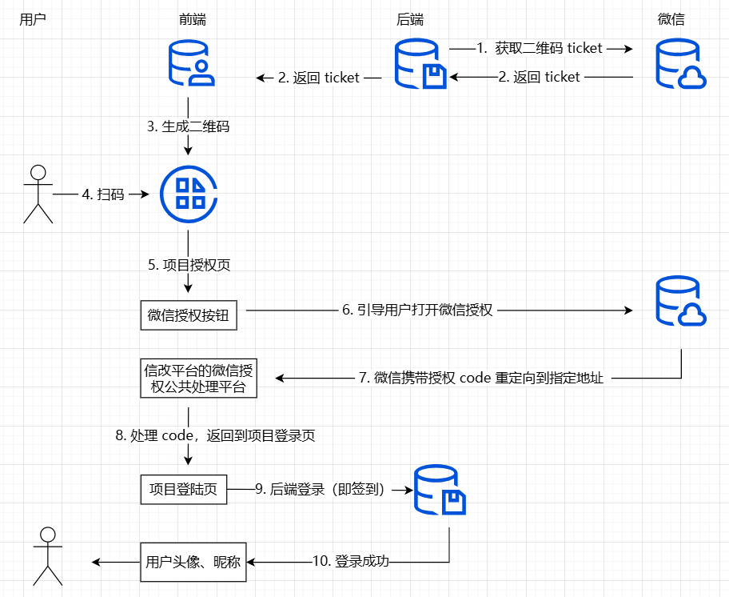

# 年会抽奖项目

基于社区模板打造的年会抽奖项目

## GitHub 社区模板

[使用这个模板创建仓库](https://github.com/ElanYoung/vite-vue-js-starter-template/generate).

## 特性

+ ⚡️ [Vite 5](https://cn.vitejs.dev) - 构建工具（就是快！）
+ 🖖 [Vue 3](https://cn.vuejs.org) - 渐进式 JavaScript 框架
+ 🚦 [Vue Router](https://router.vuejs.org/zh) - 官方路由管理器
+ 📦 [Pinia](https://pinia.vuejs.org/zh) - 值得你喜欢的 Vue Store
+ 🍪 [web-storage-cache](https://github.com/wuchangming/web-storage-cache) - 方便快捷的存储
+ 🧪 [vite-plugin-mock](https://github.com/vbenjs/vite-plugin-mock/blob/main/README.zh_CN.md) - 提供本地和生产模拟服务
+ 💻 [TDesign](https://tdesign.tencent.com/vue-next/getting-started) - TDesign 适配桌面端的组件库
+ 🎨 [Less](https://less.bootcss.com/) - CSS 预处理器
+ 📥 [APIs auto importing](https://github.com/antfu/unplugin-auto-import) - 直接使用 Composition API 无需引入
+ 😃 [Icons auto install](https://github.com/unplugin/unplugin-icons) - 按需访问成千上万的图标作为组件
+ 🔗 [Axios](https://axios-http.com/zh/) - 一个基于 promise 的网络请求库，可以用于浏览器和 node.js
+ 🧰 [Husky](https://typicode.github.io/husky/#/) + [Lint-Staged](https://github.com/okonet/lint-staged) - Git Hook 工具
+ 🛡️ [EditorConfig](http://editorconfig.org) + [ESLint](http://eslint.cn) + [Prettier](https://prettier.cn) + [Stylelint](https://stylelint.cn) - 代码规范
+ 🔨 [Commitizen](https://cz-git.qbb.sh/zh) + [Commitlint](https://commitlint.js.org) - 提交规范

## 编码风格

+ 使用 Composition API [`<script setup>` SFC 语法](https://github.com/vuejs/rfcs/pull/227)
+ [ESLint](https://eslint.org/)
+ [Prettier](https://prettier.io)
+ [Stylelint](https://stylelint.io)

## 开发工具

+ [pnpm](https://pnpm.io/zh/) - 快, 节省磁盘空间的包管理器
+ [Visual Stuido Code 扩展](./.vscode/extensions.json)
  + [Vite](https://marketplace.visualstudio.com/items?itemName=antfu.vite) - 自动启动 Vite 服务器
  + [Volar](https://marketplace.visualstudio.com/items?itemName=Vue.volar) - Vue 3 `<script setup>` IDE 支持
  + [EditorConfig for VS Code](https://marketplace.visualstudio.com/items?itemName=EditorConfig.EditorConfig) - 一套用于统一代码格式的解决方案
  + [ESLint](https://marketplace.visualstudio.com/items?itemName=dbaeumer.vscode-eslint) - 可组装的JavaScript和JSX检查工具
  + [Prettier](https://marketplace.visualstudio.com/items?itemName=esbenp.prettier-vscode) - 代码格式化工具
  + [StyleLint](https://marketplace.visualstudio.com/items?itemName=stylelint.vscode-stylelint) - CSS 代码规范工具

## 现在可以试试

> Vite5 Vue3 JavaScript Starter Template 需要 Node 版本 >= 14.18

## 使用

### 开发

> 只需要执行以下命令就可以在 <http://localhost:3000> 中看到

```bash
## 安装依赖
npm install

## 运行
npm run dev
```

### 构建

```bash
## 构建
npm run build
```

## 项目说明

### 一、大屏抽奖

欢迎页面开发地址：<http://localhost:3000/screen/welcome>

抽奖页面开发地址：<http://localhost:3000/screen/lottery>

### 二、用户登录签到

#### 1. 生成带参数的二维码

[👉️ 官方文档](https://developers.weixin.qq.com/doc/offiaccount/Account_Management/Generating_a_Parametric_QR_Code.html)

用户微信扫描二维码，可以打开对应的公众号，点击公众号推送的抽奖地址，即可跳转到项目授权页。

#### 2. 微信公众号授权

[👉️ 官方文档](https://developers.weixin.qq.com/doc/offiaccount/OA_Web_Apps/Wechat_webpage_authorization.html)

点击微信授权，微信会携带授权码 code，重定向到指定页面，最终返回到项目登录页。

#### 3. 用户签到

在登录页，将 code 传给后端进行登录（签到）。

具体流程，详见以下流程图：


